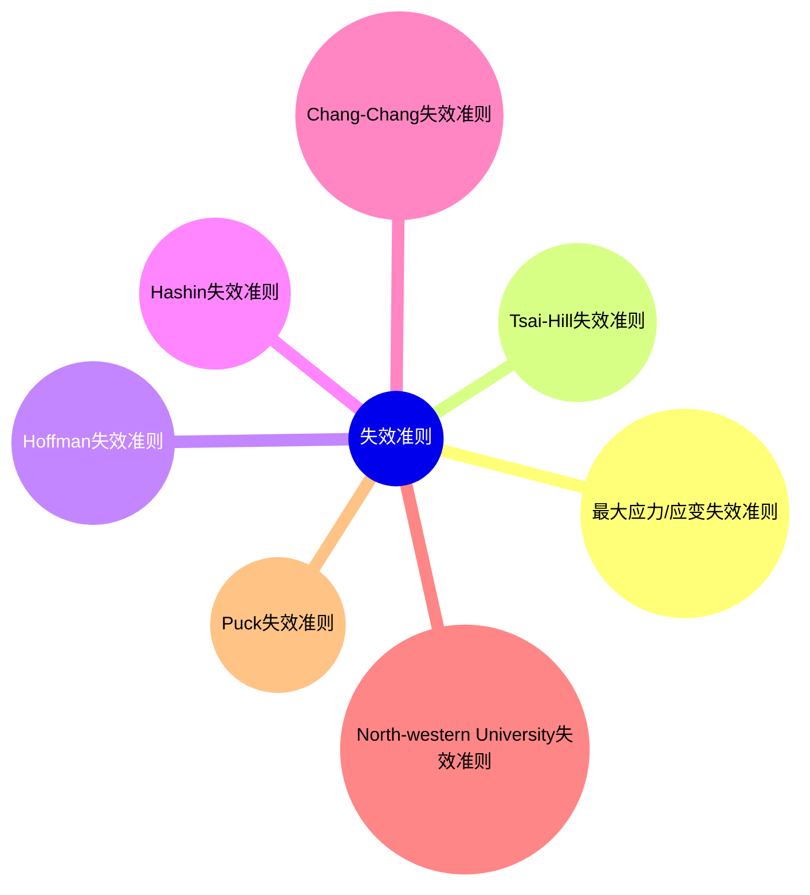

## 读<热塑性复合材料力学问题研究进展>

> Voigt定律：Fiber and Matrix have the same strain

>Tsai-Wu准则： $$ F_i \sigma_i + F_{ij} \sigma_i \sigma_j \leq 1
$$

>RVE(representative volume element)：三维代表元方法
><small>代表元方法：复合材料微观结构一般具有对称性，当远场外载荷作用时，可通过有限元方法对代表单元的应力应变响应进行计算得到宏观力学参数的方法</small>

>PEEK:聚醚醚酮
>PPS:聚苯硫醚
>PEI:聚醚酰亚胺
>PEKK:聚醚酮酮

>热塑性复合材料基体韧性高、微观结构复杂、自身缺陷多样，在完全破坏前的损伤阶段仍具有一定的承载能力，损伤断裂机制比较复杂.目前，准确预测热塑性复合材料损伤断裂行为仍十分具有挑战性。
>==（原文）==

>在宏观层面上，热塑性复合材料渐进损伤模拟的主要研究办法一般为基于实验得到的层内损伤判断准则确定热塑性复合材料的失效形式，然后采用刚度折减的方法模拟材料力学性能退化。层内损伤模式主要包括纤维拉伸或压缩失效、基体拉伸或压缩失效一级纤维基体剪切破坏五种损伤模式。
>==（原文）==

>失效准则：
>最大应力/应变失效准则
>Tsai-Hill失效准则
>Hoffman失效准则
>Hashin失效准则
>Chang-Chang失效准则
>North-western University失效准则
>Puck失效准则

>Cracking of matrix -> Matrix tension failure

$$
\begin{Bmatrix}
\sigma_{11,d} \\
\sigma_{22,d} \\
\sigma_{33,d} \\
\sigma_{12,d} \\
\sigma_{23,d} \\
\sigma_{31,d} \\
\end{Bmatrix}
=
\begin{bmatrix}
1-d_1  &         &         &         &         &    \\
       &  1-d_2  &         &         &         &    \\
       &         &  1-d_3  &         &         &    \\
       &         &         &  1-d_4  &         &    \\
       &         &         &         &  1-d_5  &    \\
       &         &         &         &         &  1-d_6 
\end{bmatrix}
\begin{Bmatrix}
\sigma_{11} \\
\sigma_{22} \\
\sigma_{33} \\
\sigma_{12} \\
\sigma_{23} \\
\sigma_{31} \\
\end{Bmatrix}
$$

